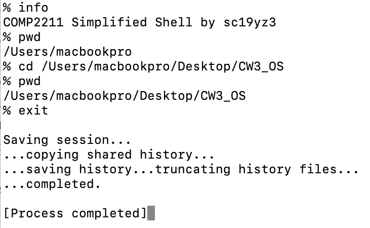
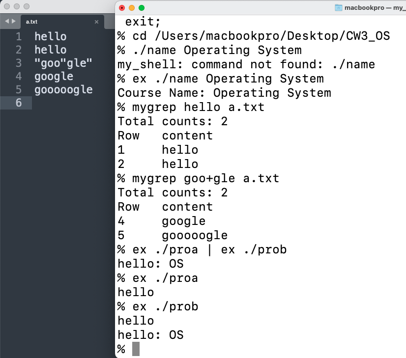
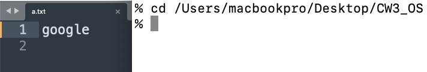
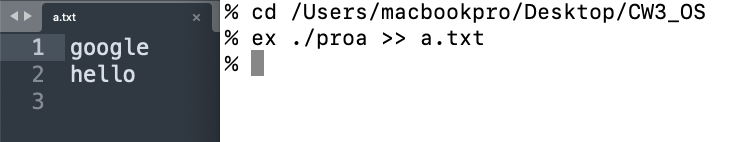
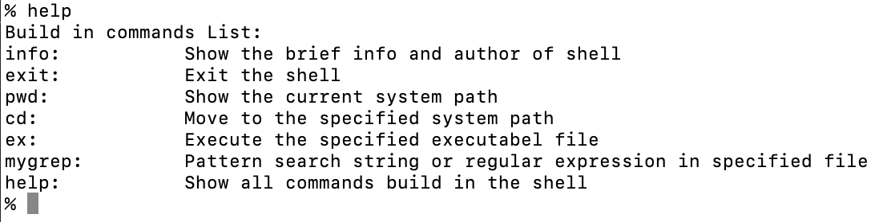

# My Shell

## **1.** ***Introduction:***

To construct this simple shell, there are four build-in commands including **info, exit, pwd and cd.** Furthermore, it can also (1) Run another program using the command with style of “ex PATH ARGS”. (2) Search and display all lines that satisfied the pattern match. (3) Construct pipeline output between two programs. (4) Redirect output of program to text file. (5) List all the build in features with brief introduction. 

## **2.** ***Methodology:***

The achievement of four build-in commands is very simple and basic. It will print brief info of shell and author for **info,** return with exit code for **exit,** use ‘getcwd’ for **pwd**, and go to specified location with ‘chdir’ for **cd**. For other features, it’s slightly more complex:

**(1)** ***ex:*** ‘fork’ is used to create a new process. Use execvp(***const*** char *file, char * ***const*** argv []) to find the name of the file that matches the argument file, to execute the file when it is found, and to pass the second argument argv to the file to be executed.

**(2)** ***mygrep:*** Firstly, iterate through each line of the file and store them in a secondary pointer ‘char **file’. Secondly, compile the regular expression string ‘char *target’ using ‘regcomp’ function. Finally, iterate through the secondary pointer ‘file’ and use ‘regexec’ to find the satisfied line in file.

**(3)** ***pipeline:*** Pipeline commands needs two new child threads to execute the command at both side of pipeline. Firstly, ‘pipe’ is used to initiate pipe and two child threads should be created. For the first child thread, the input side of pipe is closed, and the stdout is redirected to the output side of pipe. Then, ‘execvp’ is called to execute first command. For another child thread simply use the opposite method. The parent thread would continue after the two child threads have completed.

**(4)** ***redirect:*** Redirect commands need a new child thread. Firstly, the target file is opened or created using ‘open’ with arguments ‘O_WRONLY | O_CREAT | O_APPEND’. Then, a child thread would be created, and the output of program would be redirected to the target file. Finally, the parent thread would continue after the child thread havs completed.

**(5)** ***help***: Iterate through the ‘buildin_comm’ and print them with brief introduction. This is an addition feature which is very crucial in shell. It tells the build in commands list and corresponding function. It can facilitate developers, users, and learners to overview the general structure and features in the simple shell. 

## **3.** ***Practical demonstrations and results:***

**(1)** ***Build-in commands***

 

**(2)** ***Advance feature (without redirect)***

 

**(3)** ***Redirect***

 

 

**(4)** ***Help***

  

## ***Reference***

Brennan, S. 2015. **Tutorial - Write a Shell in C - Stephen Brennan**. [Online]. [Accessed 13 December 2021]. Available from: https://brennan.io/2015/01/16/write-a-shell-in-c/ .

Jonathan 2019. **The use of regular expressions in C - C language**. [Online]. [Accessed 13 December 2021]. Available from: https://segmentfault.com/a/1190000019807078 .

Li, F. 2020. **BMooS/shell with c under linux**. [Online]. [Accessed 13 December 2021]. Available from: https://gitee.com/BMooS/myshell .

panqiincs 2018. **psh1.c**. [Online]. [Accessed 13 December 2021]. Available from: https://gist.github.com/panqiincs/0fe28162319fad53dcca5a9d6d0b1e32 .